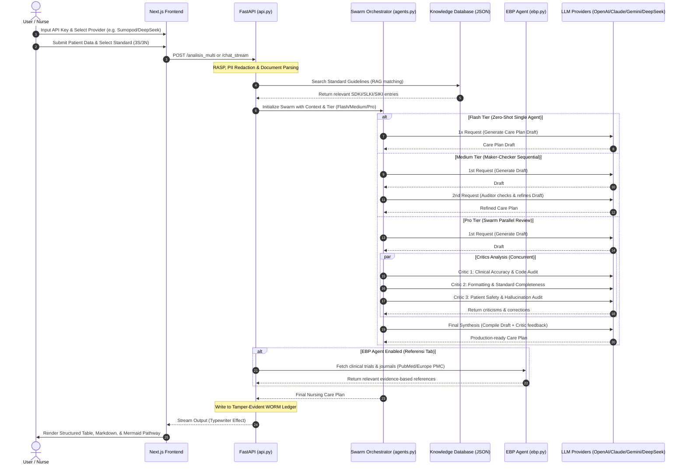

<div align="center">
  <h1>🔥 CDSS AI Keperawatan</h1>
  <p><em>An Agentic Clinical Decision Support System (CDSS) for Nursing Care Plans based on 3S (SDKI, SLKI, SIKI) and 3N (NANDA, NOC, NIC) standards.</em></p>

  [](https://www.python.org/)
  [](https://nextjs.org/)
  [](#license)
  [](#overview)
</div>

---

## Overview

**CDSS AI Keperawatan** is a production-grade Clinical Decision Support System designed to help professional nurses formulate structured, accurate, and evidence-based nursing care plans (*Asuhan Keperawatan* or *Askep*). Powered by a multi-agent swarm architecture, the system reads patient medical records, matches symptoms against official Indonesian and international clinical standards (SDKI, SLKI, SIKI / NANDA, NOC, NIC), and generates structured, official-grade clinical documentation without hallucinating codes or diagnoses.

Targeted at healthcare institutions, nurses, and clinical educators, this platform addresses the challenge of tedious administrative paperwork by parsing unstructured input (text, PDF, DOCX, CSV, or clinical photos), verifying standard-specific clinical criteria, and generating compliant clinical pathways, outcomes, and interventions. It incorporates strict security filters, PII sanitization (HIPAA & UU PDP compliance), and a tamper-evident audit ledger for mediko-legal safety.

---

## Architecture

The system is designed with a decoupled architecture featuring a FastAPI backend (orchestrator & swarm agents) and a Next.js frontend (client dashboard & director dashboard). Below is the high-level request-response and multi-agent swarm workflow.



---

## Tech Stack

| Layer | Technology | Purpose |
| :--- | :--- | :--- |
| **Frontend** | Next.js 16 (React 19), Tailwind CSS, Framer Motion | User interface, real-time typing animation, document exports (PDF/Word), session management |
| **Backend** | FastAPI (Python 3.11) | High-performance asynchronous API, RASP security, file parsing sandbox, session control |
| **Swarm Orchestrator** | LangChain / LangChain Community | LLM invocation wrapper, system prompts orchestration, concurrent agents execution |
| **Knowledge Engine** | Custom RAG (JSON database) | Strict retrieval of local medical references (SDKI, SLKI, SIKI, NANDA, NOC, NIC) |
| **MFA Security** | PyOTP (TOTP) | Cryptographic multi-factor authentication for Director / Administrator access |
| **Auditing Ledger** | WORM JSONL Audit Logs | Write-Once-Read-Many hash-chained ledger for medical-legal logging |

---

## Prerequisites

*   **Python**: 3.11.x or 3.12.x
*   **Node.js**: 20.x or higher (LTS recommended)
*   **Package Managers**: `pip` (Python) and `npm` (Node.js)

---

## Getting Started

### 1. Clone & Configure

Clone the repository and initialize the project:
```bash
git clone https://github.com/eksays/AI-Agent-Asuhan-Keperawatan.git cdss-app
cd cdss-app
```

Configure the environment variables. 
For the **Frontend**, create a `.env.local` inside the `frontend/` folder:
```bash
NEXT_PUBLIC_API_BASE=http://127.0.0.1:8000
```

For the **Backend**, environments can be passed dynamically or declared in your terminal shell. (See [Environment Variables](#environment-variables) for configuration).

### 2. Install Dependencies

#### Backend:
Activate your virtual environment and install dependencies:
```bash
# Inside cdss-app/backend/
python -m venv venv
# Activate on Windows:
venv\Scripts\activate
# Activate on Unix/macOS:
source venv/bin/activate

pip install -r requirements.txt
```

#### Frontend:
Install NPM modules:
```bash
# Inside cdss-app/frontend/
npm install
```

### 3. Run the Development Servers

You can easily launch the entire workspace by running the root script (on Windows):
```bash
start-all.bat
```

Alternatively, run each service manually in separate terminals:

**Terminal 1 (Backend)**:
```bash
cd backend
venv\Scripts\activate
uvicorn api:app --host 127.0.0.1 --port 8000 --reload
```

**Terminal 2 (Frontend)**:
```bash
cd frontend
npm run dev
```

Open your browser to **[http://localhost:3000](http://localhost:3000)**.

---

## Project Structure

```markdown
├── backend/
│   ├── data_terstruktur/      # JSON Clinical Reference Databases (SDKI, SLKI, SIKI, NANDA, etc.)
│   ├── agents.py              # Swarm orchestration agent definitions (Flash/Medium/Pro Tiers)
│   ├── api.py                 # FastAPI endpoints, security middlewares, session engine
│   ├── crypto_store.py        # Secure data store encryption and hashing
│   ├── director.py            # MFA/TOTP validation & session validation for directors
│   ├── director_setup.py      # TOTP MFA bootstrap script
│   ├── ebp.py                 # Evidence-Based Practice (PubMed/Europe PMC search agent)
│   ├── ekstraksi.py           # Offline PDF-to-JSON book parsing utility
│   ├── harvester.py           # Background journal cache warmer
│   ├── memory.py              # Session history and feedback memory (RLHF logs)
│   ├── phi.py                 # HIPAA/UU PDP compliant PII sanitization engine
│   ├── run.bat                # Dev script helper for backend
│   └── requirements.txt       # Backend dependencies
├── frontend/
│   ├── app/                   # Next.js Pages Router (Page components, Layouts, Director Dashboard)
│   ├── components/            # React UI components (Dashboard, Chatbox, Welcome dialog)
│   │   ├── app-context.tsx    # State management context (sessions, logins, API handling)
│   │   └── ui/                # Core design system components (dialogs, cards)
│   ├── lib/                   # TypeScript utilities
│   │   ├── api.ts             # Backend API client mappings
│   │   ├── types.ts           # Model resolutions, provider labels, & key autodetect
│   │   └── export.ts          # PDF/Word exporters
│   └── package.json           # Frontend dependencies
├── start-all.bat              # Multi-process launcher bat script
└── JALANKAN.md                # Indonesian quickstart guide
```

---

## API Reference

### User Operations

#### 1. Create cryptographic session
*   **Method / Path**: `POST /session`
*   **Auth**: None
*   **Description**: Generates a 256-bit CSPRNG session ID. The frontend must obtain a session ID through this endpoint to prevent session-hijacking and cross-user leaks.
*   **Response**:
    ```json
    { "status": "sukses", "session_id": "session_id_hash_string" }
    ```

#### 2. Analyze patient medical record
*   **Method / Path**: `POST /analisis_multi`
*   **Auth**: `Authorization: Bearer <api_key>`
*   **Form Parameters**:
    *   `provider`: Provider target name (e.g. `sumopod`, `openai`, `deepseek`)
    *   `model`: Target LLM model ID (e.g. `deepseek-v4-pro`)
    *   `framework`: Standard standard (`3S` / `3N`)
    *   `session_id`: active session ID
    *   `tier`: Swarm logic depth (`flash` / `medium` / `pro`)
    *   `agent`: Selected agent (`analisis` / `pathway` / `referensi`)
    *   `gejala`: Text query / clinical symptoms
    *   `file_dokumen` *(Optional)*: Uploaded PDF/DOCX/TXT file
    *   `file_foto` *(Optional)*: Uploaded Image file (medical record photo)
*   **Response**: Returns structured JSON care plan output.

#### 3. Chat with streaming output
*   **Method / Path**: `POST /chat_stream`
*   **Auth**: `Authorization: Bearer <api_key>`
*   **Form Parameters**: Same as `/analisis_multi`
*   **Response**: Standard `text/event-stream` returning incremental tokens.

#### 4. Delete user data (Right to be Forgotten - UU PDP compliance)
*   **Method / Path**: `POST /delete_my_data`
*   **Auth**: None (Verifies by `session_id`)
*   **Payload**: `{ "session_id": "..." }`
*   **Description**: Purges all history logs and session context permanently from the server memory.

---

## Environment Variables

### Backend Configuration
| Variable | Required | Default | Description |
| :--- | :--- | :--- | :--- |
| `FRONTEND_ORIGINS` | No | `http://localhost:3000,http://127.0.0.1:3000` | Allowed CORS origins separated by commas. |
| `DIRECTOR_BOOTSTRAP` | No | `""` | Key to register the first Director Admin MFA device. |
| `SHOPEE_BASE_URL` | No | `https://openrouter.ai/api/v1` | Custom base URL for ShopeeAI gateway. |
| `API_KEY_EKSTRAKSI` | No | `""` | Target API Key for `ekstraksi.py` (do not hardcode). |

### Frontend Configuration
| Variable | Required | Default | Description |
| :--- | :--- | :--- | :--- |
| `NEXT_PUBLIC_API_BASE`| No | `http://127.0.0.1:8000` | Base endpoint of the FastAPI backend. |

---

## Testing

Backend unit tests can be implemented to test the swarm output formats:
```bash
cd backend
python -m unittest discover -s tests -p "*_test.py"
```

Frontend linters and TypeScript builds can be validated using:
```bash
cd frontend
npm run lint
npm run build
```

---

## Deployment

### Docker Deployment
The system can be deployed containerized using the provided `Dockerfile` manifests.

#### Build Backend Image:
```bash
cd backend
docker build -t cdss-backend .
docker run -d -p 8000:8000 cdss-backend
```

#### Build Frontend Image:
```bash
cd frontend
docker build -t cdss-frontend .
docker run -d -p 3000:3000 cdss-frontend
```

---

## Contributing

1.  **Branching Strategy**: Use `main` for stable releases, and `dev` for active updates.
2.  **Pull Requests**: Document your features, ensure your linter is clean, and reference any issues resolved.
3.  **Commit Conventions**: Follow conventional commits (e.g. `feat(api): ...`, `fix(ui): ...`, `docs: ...`).

---

## License

This project is licensed under the [MIT License](LICENSE).
